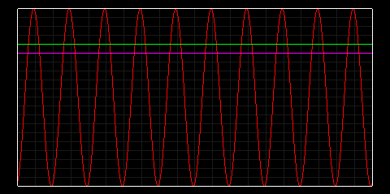
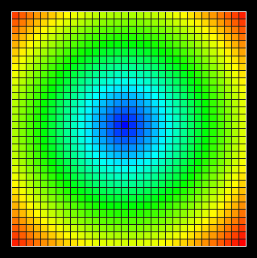
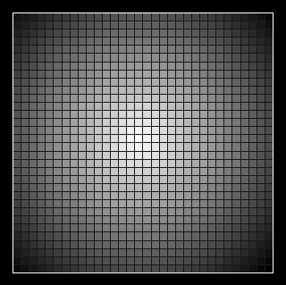
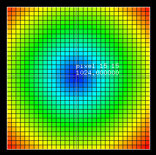
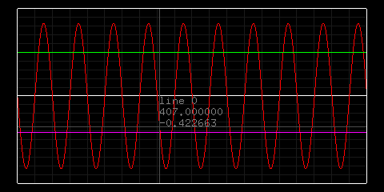

# easy_plot_cpp
Простая библиотека C++ для рисования графиков и тепловых карт

### Описание

Данная *header-only* библиотека позволяет рисовать простые графики или тепловые карты сразу из программы.

Пример:




Отличия от других библиотек и особенности:

* Для работы нужен только *FreeGLUT*, не нужно устанавливать громоздкий *OpenCV* или быть зависимым от *matplotlib*
* Библиотека содержит мало кода, помещается в один *header* файл, ее можно легко доработать под свои нужды
* Рисование графиков происходит в отдельном потоке, можно перерисовывать графики
* Можно рисовать тепловые карты
* Можно использовать курсор мыши для получения данных графика или тепловой карты

### Как установить?

Инструкция для *Code::Blocks* и компилятора *mingw*

* Подключить библиотеку *freeglut* или *freeglut_static* (во втором случае также установите макрос FREEGLUT_STATIC), а также *opengl32*, *winmm*, *gdi32*. Скачать *freeglut* для компилятора *mingw* можно здесь [https://www.transmissionzero.co.uk/software/freeglut-devel/](https://www.transmissionzero.co.uk/software/freeglut-devel/) 
* Подключить в проекте заголовочный файл *include/easy_plot.hpp*, а так же указать пути к *include*, *freeglut/include*, *freeglut/lib/x64*
* Указать С++11 или выше

Для проверки можно запустить код:

```C++
#include "easy_plot.hpp"

int main(int argc, char* argv[]) {
    ep::init(&argc, argv);
	
    std::vector<double> x = {0,1,0,1,2,0,1};
    ep::plot("X", x);

    // ставим красный цвет линии
    std::vector<double> y = {0,2,3,4,2,0,1};
    ep::plot("Y", y, ep::LineSpec(1,0,0));

	
    std::vector<double> x2 = {0,2,6,7,8,10,12};
    ep::plot("XY", x2, y, ep::LineSpec(1,1,0));

    ep::WindowSpec wstyle; // тут можно настроить стиль графика (цвет фона и пр.)
    // выводим три графика в одном
    ep::plot<double>("Y1Y2Y3", wstyle, 3, x, ep::LineSpec(1,0,0), x2, ep::LineSpec(1,0,1), y,     ep::LineSpec(0,1,0));

    while(true) {
        std::this_thread::yield();
    }
    return 0;
}
```

Чтобы нарисовать тепловую карту:

```C++
#include "easy_plot.hpp"

int main(int argc, char* argv[]) {
    ep::init(&argc, argv);
	
    ep::WindowSpec image_wstyle;
    image_wstyle.is_grid = true;
    image_wstyle.height = 320;
    image_wstyle.width = 320;
    float image_data[32][32] = {};
    size_t image_ind = 0;
    for(size_t x = 0 ; x < 32; ++x) {
        for(size_t y = 0; y < 32; ++y, ++image_ind) {
            image_data[x][y] = 1024 - std::sqrt((x - 18) * (x - 18) + (y - 18) * (y - 18));
        }
    }

    image_wstyle.is_color_heatmap = true;
    ep::draw_heatmap("image_heatmap", image_wstyle, &image_data[0][0], 32, 32);

    while(true) {
        std::this_thread::yield();
    }
    return 0;
}
```

Программа нарисует такую тепловую карту:



### Как пользоваться

* Для рисования графика вызовите подходящую для ваших нужд *ep::plot* функцию
* Функция *plot* может принимать такие параметры, как имя окна, стиль окна (различные настройки цвета и пр., см. *WindowSpec*), данные графиков и стиль линий. 
* Функция *draw_heatmap* может принимать такие параметры, как имя окна, стиль окна (различные настройки цвета и пр., см. *WindowSpec*), данные массива тепловой карты типа float и размер тепловой карты
* Если графиков несколько, изначально они будут расположены по всему экрану равномерно, как на картинке

* Если навести курсор мыши на график, можно узнать номер линии и данные по осям X и Y

### Полезные ссылки

* *GLUT* (https://www.opengl.org/resources/libraries/glut/)[https://www.opengl.org/resources/libraries/glut/]
* *FreeGLUT* (http://freeglut.sourceforge.net/)[http://freeglut.sourceforge.net/]
* *FreeGLUT mingw* (https://www.transmissionzero.co.uk/software/freeglut-devel/)[https://www.transmissionzero.co.uk/software/freeglut-devel/]
* *GL2PS* (http://www.geuz.org/gl2ps/)[http://www.geuz.org/gl2ps/]
* *GL2PS gitlab* (https://gitlab.onelab.info/gl2ps/gl2ps)[https://gitlab.onelab.info/gl2ps/gl2ps]
